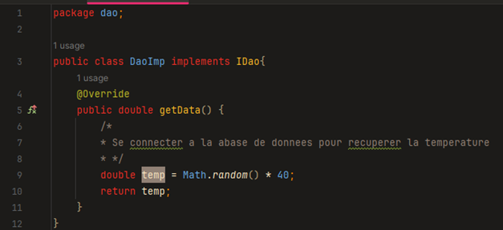

<h1>TP Injection des dependances</h1>
<h2>Partie I : Création de l'interface et des implémentations</h2>
<h3>1. Création de l'interface IDao avec une méthode getData</h3>

L'interface IDao est conçue pour représenter une source de données abstraite. Elle contient une seule
méthode :

Cette méthode getData() est censée retourner une donnée de type double, sans spécifier d'où elle
provient (par exemple, une base de données ou une API).

<h3>2. Implémentation de l'interface IDao</h3>

Nous implémentons l'interface IDao à travers une classe qui simule la récupération de données depuis
une source précise :

Ici, la classe DaoImp retourne une valeur aléatoire pour simuler la récupération de données externes.

<h3>3. Création de l'interface IMetier avec une méthode calcul
</h3>

L'interface IMetier est une abstraction de la logique métier. Elle contient une méthode :

Cette méthode calcul() utilise des données fournies par un objet de type IDao pour effectuer un
calcul.

<h3>4. Implémentation de l'interface IMetier avec couplage faible</h3>

Dans cette partie, nous implémentons l'interface IMetier en utilisant le principe du couplage faible
(Dépendance par abstraction). La classe ne dépendra pas directement de l'implémentation spécifique de
IDao mais de l'interface.

Ici, la classe MetierImpl utilise un objet de type IDao pour récupérer les données nécessaires à son
calcul, mais elle ne connaît pas l'implémentation spécifique de IDao. Cela permet de changer
l'implémentation de IDao sans impacter la classe MetierImpl.

<h2>Partie II : Injection des dépendances</h2>
<h3>1. Injection par instanciation statique</h3>

Dans cette méthode, l'objet dépendant est créé manuellement au sein de l'application, créant ainsi une forte dépendance entre les classes.

Ici, DaoImpl est instancié directement dans la classe principale, puis injecté dans MetierImpl. Cela
crée un couplage relativement fort entre les classes.

<h3>2. Injection par instanciation dynamique (Réflexion)</h3>

L’instanciation dynamique permet de réduire le couplage en créant les objets à la volée en utilisant la
réflexion Java, ce qui donne plus de flexibilité.

Cette méthode utilise la réflexion pour créer les objets et injecter les dépendances dynamiquement. Elle
réduit le couplage direct entre les classes, mais peut rendre le code plus difficile à maintenir et à
déboguer.

<h3>3. Injection avec le Framework Spring :
</h3>
<h4>a. Version XML :</h4>

Spring permet d'injecter les dépendances via des configurations XML, rendant le code encore
plus flexible.

<h4>Fichier « applicationContext.xml »</h4>

<h4>Code JAVA :</h4>

Spring gère l'instanciation et l'injection des dépendances grâce à la configuration dans le fichier
XML.

<h4>Version annotation :</h4>

Spring permet également de gérer l'injection de dépendances avec des annotations pour éviter
les fichiers de configuration XML.

 

Avec les annotations @Component et @Autowired, Spring peut injecter automatiquement
les dépendances sans avoir besoin de fichier XML, ce qui simplifie la configuration.

<h4>Code JAVA :</h4>
